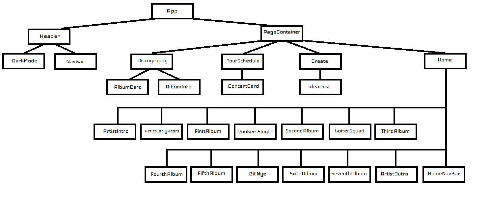

# Group 4 (Clover) Phase 2 Project - Tyler, the Creator Fan Page

## Contributors: Sarah Baughman, Halim Choi, Andrew O’Brien, Ryan Rojas 
#
#### SETUP

1. Run `npm install` in your terminal.
2. Run `npm run server`. This will run your backend on port `6001`.
3. In a new terminal, run `npm start`.

Make sure to open the following in the browser to verify that your backend is working before you proceed: 

    http://localhost:6001/albums
    http://localhost:6001/concerts
    http://localhost:6001/ideas

#
#### USER STORY

As a user I can: 
 - View basic information about Tyler the Creator on the Home Page
 - Use the navigation bar to view the discography, tour schedule and create page
 - View the artist’s full discography sorted by album, click each album cover to see each respective track list
 - Search the simulated tour schedule by city, state or venue to see when the artist will be visiting nearby
 - Submit a new idea for Tyler using a form, as well as view other users' ideas on the Create page
 - Switch between light and dark mode using a switch at the top-right of the page
#
#### API INFO
 - Using an external API to fetch album name, album image and album release year:

    https://theaudiodb.com/api/v1/json/2/album.php?i=112028

 - Using db.json to fetch album songs, tour schedule information (city, state, venue, date), and create ideas comments. 

	   
#
#### COMPONENT HIERARCHY 

App 
- Header
    - DarkMode
    - NavBar
- PageContainer
    - Home
        - HomeNavBar
        - ArtistIntro
        - ArtistEarlyYears
        - FirstAlbum
            - YoutubeEmbed
        - YonkersSingle
            - YoutubeEmbed
        - SecondAlbum
            - YoutubeEmbed
        - LoiterSquad
            - YoutubeEmbed
        - ThirdAlbum
            - YoutubeEmbed
        - FourthAlbum
            - YoutubeEmbed
        - BillNye
            - YoutubeEmbed
        - FifthAlbum
            - YoutubeEmbed
        - SixthAlbum
            - YoutubeEmbed
        - SeventhAlbum
            - YoutubeEmbed
        - ArtistOutro
    - Discography
        - AlbumCard
        - AlbumInfo
    - TourSchedule
        -ConcertCard
    - Create
        - IdeaPost
#
#### VISUAL COMPONENT HIERARCHY
